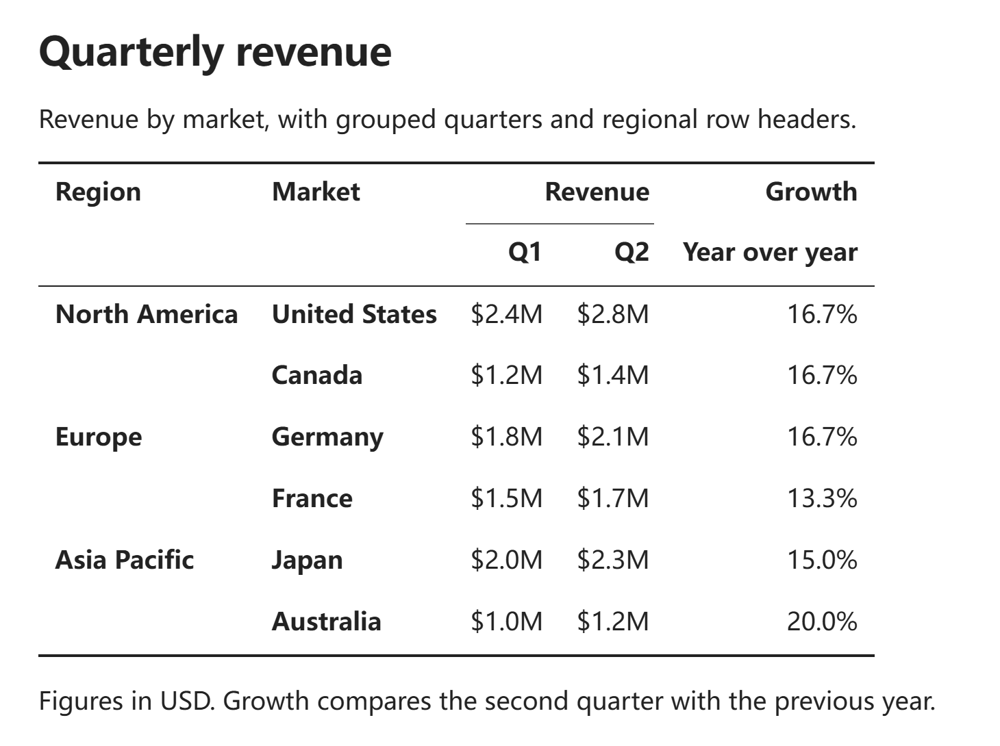
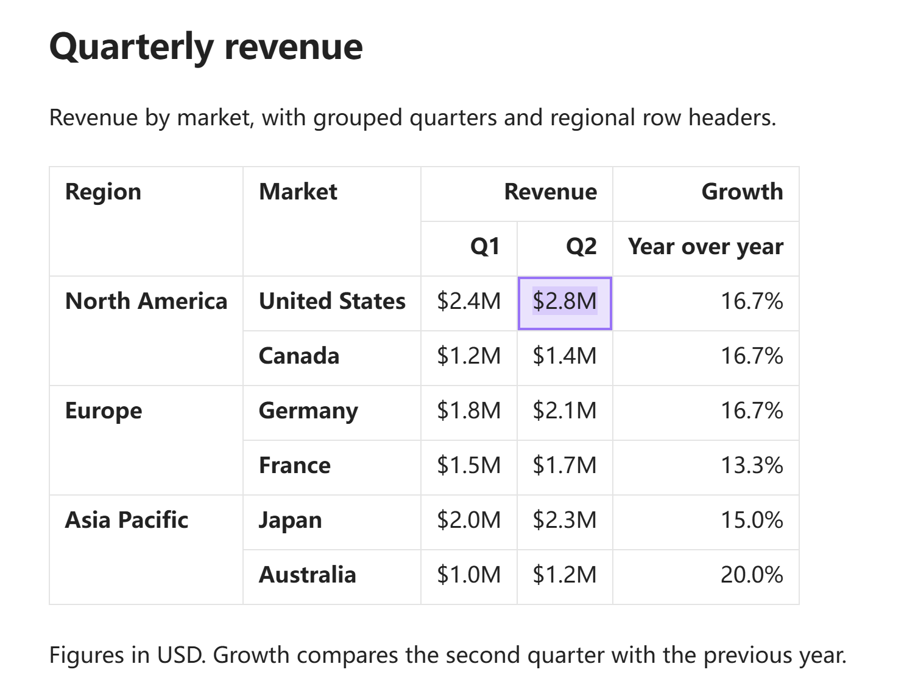
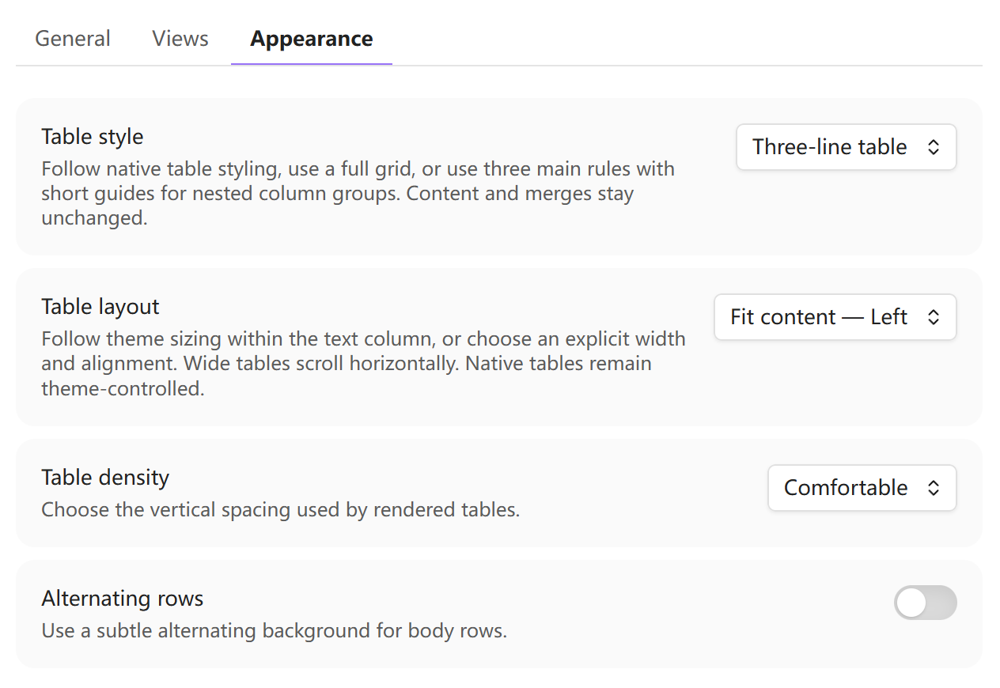

# Structural Tables

[English](../../README.md) · [简体中文](README.zh-CN.md)

Structural Tables 在普通 Markdown 管道表格上增加合并单元格、多行列表头和行表头，同时保持源码可读、可迁移。

## 界面截图

### 阅读视图

结构语义会渲染为清晰、可访问的表格，而笔记仍保持普通管道表格 Markdown。



### 实时预览

光标离开表格即可查看渲染结果；桌面端单击单元格、触屏上双击单元格即可原位编辑。



### 设置

“常规”“视图”和“外观”将导入、渲染、普通表格接管、诊断、布局与样式设置清楚地分开。



<!-- section: features -->
## 功能

- 使用内容严格等于 `<` 的单元格向左合并，使用 `^` 向上合并。
- 分隔行前连续的多行作为多行列表头。
- 在分隔行内部放置一个相邻的 `||`，标记行表头列。
- 在阅读视图和实时预览中渲染有语义、可访问的表格。
- 支持原位编辑单元格，并自动转义粘贴的 Wiki 链接中的 `|`。
- 用把手选中整行或整列，再从右键菜单执行插入、删除、移动、对齐、合并、拆分或设置表头；桌面端仅显示当前悬停、键盘聚焦或已选中的把手，粗指针设备始终显示触摸尺寸的把手。
- 从浏览器和电子表格粘贴 HTML 表格，并保留跨行与跨列结构。
- 将有效表格复制为语义 HTML、普通 GFM、TSV 或 CSV；展开为 GFM 前可先预览。
- 将明确的 Sheets Extended 伪分隔列转换为规范行表头语法。
- 从右键菜单或命令面板把有效的普通或结构表格升级为嵌入式 Obsidian Base，每一行成为独立 Markdown 笔记。
- 用适合 Obsidian 属性界面的 `structural-tables` 列表保存成员资格；记录无需插件专用的自身 ID，移动或重命名后仍属于原 Base。
- 升级前显示展开规则和阻断问题，创建带格式版本的恢复清单，失败时把新建目录移入废纸篓；恢复原表格时保留生成的笔记，并把通过 Base 原生“新建”或插件命令创建的后续记录整理到宿主笔记当前目录旁。
- 无效结构只提示，不改写笔记。

<!-- section: requirements-and-compatibility -->
## 要求与兼容性

Structural Tables 要求 Obsidian 1.12.7 或更高版本，支持桌面版 Obsidian 与 Android。“升级为 Base”还要求启用 Obsidian 核心插件 Bases。插件会解释结构表格中严格匹配的 `<`、`^` 与分隔行 `||`。默认情况下，若已启用的其他表格插件会为这些记号赋予重叠含义，插件会在启动后提示一次。

<!-- section: installation -->
## 安装

可从 Obsidian 第三方插件目录安装 Structural Tables：打开**设置 → 第三方插件 → 浏览**，搜索 **Structural Tables**，点击**安装**，然后启用插件。

如需手动安装，请从[最新版本](https://github.com/ZHYX91/obsidian-structural-tables/releases/latest)下载 `structural-tables-<version>.zip`，解压到 `Vault/.obsidian/plugins/`。压缩包包含 `structural-tables/` 目录及其中的 `main.js`、`manifest.json` 和 `styles.css`。重新加载 Obsidian，再在第三方插件中启用 Structural Tables。

<!-- section: usage -->
## 用法

1. 在 Markdown 笔记中创建或粘贴一个普通管道表格；
2. 用严格匹配的 `<` 单元格向左合并，用严格匹配的 `^` 单元格向上合并，或在分隔行内部放置一个相邻的 `||`，把它左侧的列标记为行表头；
3. 在实时预览中把光标移出表格，或切换到阅读视图，即可查看渲染结果；
4. 在桌面端单击或在触屏上双击已渲染的单元格，或选中后按 Enter/F2，可原位编辑；Enter 提交，Escape 取消，Tab 提交并前往下一格；
5. 使用行列把手、用鼠标拖过多个单元格，或在 Android 上依次点选矩形的首格和末格，再通过右键或长按执行插入、安全删除、移动、对齐、合并、拆分或设置表头；
6. 从浏览器、Excel 或 Google Sheets 粘贴 HTML 表格，可保留受支持的跨行与跨列结构；
7. 从命令面板预览并确认规范格式化，将当前有效表格复制为 HTML、GFM、TSV 或 CSV，预览展开为 GFM 的结果，或迁移 Sheets Extended 行表头分隔列；
8. 右键表格并选择“升级为 Base…”；结构表格使用“展开结构并升级为 Base…”，预览会说明表头路径展开、行表头转为普通 Property、合并行表头值重复以及阻断升级的数据区合并单元格。

```markdown
| 地区 | 销售额 | <   |
| 季度 | Q1     | Q2  |
| ---  || ---   | --- |
| 华北 | 10     | 12  |
| ^    | 8      | 11  |
```

分隔行之前、列数相同且连续的所有行都是列表头。`||` 只能在分隔行内部出现一次，不增加列数；它左侧的列为行表头。合并区域必须解析到同一个左上角内容单元格，构成完整矩形，并且不能跨越表头/数据角色边界。若要显示字面量记号，请写 `\<` 或 `\^`。

单元格内的 `<br>`、`<br/>` 与 `<br />` 都会在阅读视图和插件接管的实时预览表格中显示为视觉换行。Structural Tables 会保留用户写下的具体形式，不会自动统一。这不是真正的多行或块级内容：格式化会原样保留标签，转换和导出则不会赋予它特殊的换行语义。

一旦出现任一结构特性，所有行都必须与分隔行严格等宽。无效结构保留原 Markdown 并显示诊断。“格式化当前结构表格”会先预览规范形式，只有明确确认后才替换源码：左上角保存内容，合并区域首行其余单元格使用 `<`，下方覆盖单元格使用 `^`。转换为 GFM、TSV 或 CSV 时会重复合并值，并用 ` / ` 连接多行列表头路径，使展开结果保持明确。

在实时预览中，普通 Markdown 表格默认沿用 Obsidian 原生编辑器。启用“接管普通 Markdown 表格”后，不改变 GFM 源码也能获得与结构表格一致的渲染控件、行列把手、单元格选区、原位编辑、右键菜单、布局、密度和交替行底色；关闭后立即恢复原生行为。已渲染表格使用跟随主题的语义背景：列表头和左上角表头比行表头更突出。把手仅按当前悬停、键盘聚焦或已选中的行列逐个显现，不会铺满整个表格。向插件接管的单元格粘贴 `[[目标|别名]]` 或 `![[图片|尺寸]]` 时，会自动保存为表格安全的 `[[目标\|别名]]` 与 `![[图片\|尺寸]]`，且不会重复转义。会丢弃非空内容或破坏合并矩形的操作会被拒绝。

提升操作会在 `<宿主目录>/_structural-table-records/<table-id>/` 创建记录。每条记录使用普通列表属性：

```yaml
structural-tables:
  - stb_example
```

该目录只是创建收件箱，不是成员边界：移动或重命名记录笔记不会改变成员资格。宿主笔记移动后，已有记录保持用户安排的位置。使用生成 Base 的原生“新建”时，插件无需添加记录 ID，也能把刚创建的笔记移入宿主笔记旁的收件箱；如果用户已经主动移动了该笔记，就保留用户选择的位置。“为当前已提升 Base 新建记录”仍可从命令面板和右键菜单使用。使用“从当前已提升 Base 恢复表格”可从 `_promotion.json` 恢复原表格；生成的笔记会刻意保留。导入的单元格值按字符串保存，因此前导零和标识符不会变化。

现有使用 `structural_table_ids` 的 Base 仍可继续使用。执行“迁移旧版 Structural Tables Base 属性…”可先预览全部受影响文件，再替换旧成员属性和 Base 过滤条件，并可选择移除已停用的 `structural_record_id`。插件不会在启动时自动迁移；旧、新成员属性无效或互相冲突时，迁移会停止且不会覆盖它们。

<!-- section: settings -->
## 设置

设置页沿用 Obsidian 原生控件，分为“常规”“视图”和“外观”三个页签。“常规”控制 HTML 表格粘贴转换和启动冲突提示；“视图”除阅读视图、实时预览和诊断外，还提供默认关闭的普通表格接管。新安装默认使用“适应内容宽度—靠左”，也可改为“适应内容宽度—居中”或“适应窗格宽度”。“外观”还控制舒适/紧凑密度和交替行底色；界面语言可跟随 Obsidian，或使用英文/简体中文。

<!-- section: limitations -->
## 局限

Structural Tables 不支持公式、单元格样式、块级或真正的多行单元格内容、标题、编号、重复表头源码属性，也不会自动把导入 HTML 单元格内的富文本转换为 Markdown；导入的单元格内容使用纯文本。升级为 Base 会把布局结构展开为 Property：多行列表头路径用 ` / ` 连接，行表头变为普通 Property，合并行表头值写入覆盖的每条记录。数据区合并单元格会阻断确认并标出位置，必须先拆分。原生“新建”收编只处理刚创建且唯一匹配一个 Structural Tables Base 的笔记；有歧义的笔记会保留在原位置。恢复要求生成的 `_promotion.json` 仍位于 Base 代码块记录的路径。解析器会主动拒绝有歧义或非矩形的合并。

<!-- section: privacy-and-security -->
## 隐私与安全

Structural Tables 完全在本地工作，不发起网络请求、不加载远程资源、不收集分析数据，也不会发送笔记内容。渲染不会改变 Markdown；原位编辑和菜单操作均由用户显式触发，并会在替换前验证结果。提升操作只创建预览中列出的本地记录笔记和恢复清单；提升失败时，新建的表格专属目录会移入 Obsidian 配置的废纸篓。

<!-- section: development -->
## 开发

使用 Node 24.19.0 与 npm 11.17.0。

```bash
npm ci
npm run check
```

开发者参考文档：

- [产品需求](../product-requirements.zh-CN.md)
- [交互规范](../ux-spec.zh-CN.md)
- [架构说明](../architecture.zh-CN.md)
- [测试策略](../testing-strategy.zh-CN.md)
- [发布流程](../release.zh-CN.md)
- [变更日志](../../CHANGELOG.md)
- [贡献指南](../../CONTRIBUTING.md)
- [安全策略](../../SECURITY.md)

<!-- section: support -->
## 支持

- 工作流想法和一般反馈请发布到 [General](https://github.com/ZHYX91/obsidian-structural-tables/discussions/categories/general)；
- 使用和配置问题请发布到 [Q&A](https://github.com/ZHYX91/obsidian-structural-tables/discussions/categories/q-a)；
- 可复现缺陷和明确的功能建议请使用结构化的 [GitHub Issue 表单](https://github.com/ZHYX91/obsidian-structural-tables/issues/new/choose)，并提供 Obsidian 版本、编辑模式、主题、相关表格 Markdown、预期结果和实际结果；
- 安全漏洞只能通过 GitHub 的[私人漏洞报告](https://github.com/ZHYX91/obsidian-structural-tables/security/advisories/new)提交，详细要求见[安全策略](https://github.com/ZHYX91/obsidian-structural-tables/security/policy)。

不要在公开页面发布真实的 Vault 路径、笔记内容、凭据或个人信息。

<!-- section: license -->
## 许可证

[MIT](../../LICENSE) © ZhengYX
