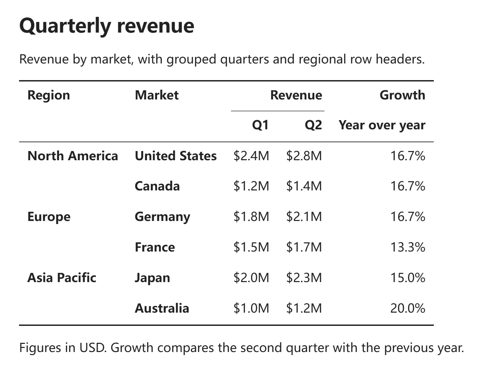
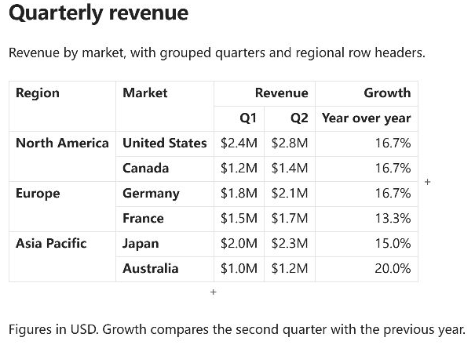
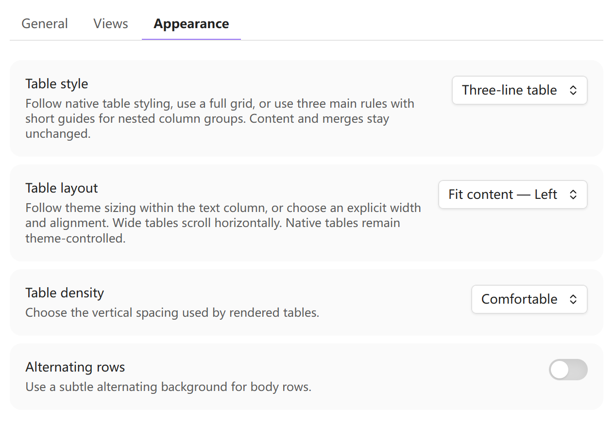

# Structural Tables

[English](../../README.md) · [简体中文](README.zh-CN.md)

Structural Tables 在普通 Markdown 管道表格上增加合并单元格、多行列标题、行标题和无列标题表格。Markdown 仍然保持可读，仅仅查看表格不会改写笔记。

表格可以放在引用、Callout 和列表续行中；编辑或格式化后仍会留在原来的位置。只有在转换为 Obsidian Base 前，才需要先把嵌套表格移到顶层。

## 界面截图

### 阅读视图中的三线表

用多行列标题组织分组列，用跨行合并的行标题归类相关记录。三线表在列分组下方增加短分组线，同时保持表体简洁。



### 实时预览

在实时预览中直接编辑单元格，合并表头始终保持可见。这里为同一张表选用了网格样式；桌面端单击单元格、触屏上双击单元格即可原位编辑。



### 外观设置

独立选择“跟随主题”“网格表”或“三线表”，并按需调整表格布局和密度。“常规”“视图”和“外观”三个页签让设置保持清晰。



<!-- section: features -->
## 功能

- 用内容严格等于 `<` 或 `^` 的单元格合并左侧或上方单元格。
- 支持多行列标题、用 `||` 标记左侧行标题列，以及完全没有列标题的表格。
- 在阅读视图和实时预览中显示相同的合并结构。
- 在实时预览中直接编辑单元格，并可增删、移动、对齐行列，合并或拆分选区，以及在不删除文字的情况下改变标题角色。
- 从浏览器、Excel 和 Google Sheets 粘贴受支持的 HTML 表格，并保留跨行、跨列结构。
- 将表格复制为 HTML、普通 GFM、TSV 或 CSV。
- 在桌面端预览完整表格 PNG，并复制图片或保存为 Vault 附件。
- 可选让 Structural Tables 编辑普通 GFM 表格；关闭该设置后立即恢复 Obsidian 原来的表格界面，Markdown 不会因此改变。
- 将表格转换为 Obsidian Base，并在确认前查看生成的记录笔记和属性映射。记录移动或重命名后仍会继续出现在原来的 Base 中。
- 拒绝会意外丢失未选中内容或隐藏源码的写入；用户明确清空或删除可见选区时允许移除所选内容。结构语法有误时保持原样并显示诊断，而不是静默改写笔记。

<!-- section: requirements-and-compatibility -->
## 要求与兼容性

Structural Tables 要求 Obsidian 1.12.7 或更高版本，支持桌面版 Obsidian 和 Android。将表格转换为 Base 还需要启用 Obsidian 核心插件 Bases。

在 Structural Table 中，严格匹配的 `<`、`^` 和分隔行里的 `||` 有特殊含义。如果检测到其他已启用的表格插件也使用这些记号，Structural Tables 会提示一次可能的冲突。

启用**阅读视图渲染**后，使用 Obsidian Markdown 渲染器的图片导出工具也可以呈现合并表格。导出前请先保存笔记，并检查导出预览。如果导出片段无法与已保存的源码唯一对应，插件会保留原样，不猜测合并关系。

在 Obsidian 1.13.7 中，部分启用 FakeLink 的桌面插件组合可能让新打开的独立窗口在阅读视图中显示空白。先切回 Obsidian 主窗口一次，再返回独立窗口，笔记可能就能完成渲染。若仍为空白，可在主窗口阅读，或使用实时预览。

若要使用 Advanced Tables 等插件的源码命令，右键单元格并选择**编辑表格源码**。打开工具栏或对话框时，源码选区会保持原位。Tab/Enter 的行为由 Advanced Tables 自行决定；需要时请切换到 Obsidian 的源码模式。使用第三方排序或行列移动后，请检查单元格内容及合并关系：语法有效并不代表原意未变。无效的结构语法会保持可见并显示诊断；Structural Tables 不会静默修复或撤销其他插件的修改。

<!-- section: installation -->
## 安装

可从 Obsidian 第三方插件目录安装 Structural Tables：打开**设置 → 第三方插件 → 浏览**，搜索 **Structural Tables**，点击**安装**，然后启用插件。

如需手动安装，请从[最新版本](https://github.com/ZHYX91/obsidian-structural-tables/releases/latest)下载 `structural-tables-<version>.zip`，解压到 `Vault/.obsidian/plugins/`。压缩包包含 `structural-tables/` 目录及其中的 `main.js`、`manifest.json` 和 `styles.css`。重新加载 Obsidian，再在第三方插件中启用 Structural Tables。

<!-- section: usage -->
## 用法

**快速上手：** 先创建 Markdown 表格；在要合并的单元格里输入 `<`（向左合并）或 `^`（向上合并）；在实时预览中将源码光标移出表格，或者切换到阅读视图查看效果。需要修改内容时，点击实时预览中的单元格即可。

1. 先创建或粘贴一张普通 Markdown 管道表格。
2. 在单元格中写 `<` 可与左侧单元格合并，写 `^` 可与上方单元格合并。
3. 在分隔行中放置一个相邻的 `||`，可把它左侧的列标记为行标题。
4. 在实时预览中把源码光标移出表格，或切换到阅读视图，即可查看渲染结果。若要再次编辑原始 Markdown，右键已渲染的单元格并选择**编辑表格源码**。
5. 在实时预览中点击单元格即可编辑文字。Enter 保存并前进，Escape 取消；其他快捷键和撤销规则见下方**高级编辑与安全删除**。
6. 通过表格边缘的 **+**、行列把手和右键菜单，添加、移动、合并、拆分或删除表格内容。Delete/Backspace 只清空所选文字，不会直接删除表格结构。
7. 将受支持的 HTML 表格直接粘贴到 Markdown 编辑器中即可导入。格式化、复制和 Sheets Extended 迁移从命令面板执行；转换为 Base 可从命令面板或表格右键菜单执行。

阅读视图只负责显示；原位编辑和表格控件位于实时预览中。

### 高级编辑与安全删除

单击普通文字时，如果可以准确对应到 Markdown 源码，光标会定位到点击处；文字带格式或位置不明确时，会先选中整个编辑草稿。Enter 保存并移到下一逻辑行的同一列（末行会自动新增一行）；Shift+Enter 插入视觉换行，Tab 移到下一个可见单元格。编辑框内可用 Cmd/Ctrl+B、Cmd/Ctrl+I 切换 Markdown 加粗与斜体。输入、中文输入法、粘贴、换行和这些快捷键可在草稿内撤销或重做，保存前不会改动笔记。其他格式化命令请使用**编辑表格源码**。

选中表格网格后，Shift+方向键可调整选区；Delete/Backspace 只清空所选单元格的内容，不删除行、列、表头类型或合并关系。确实要移除结构时，请右键选择**删除所选行**、**删除所选列**或**删除表格**，不必先清空文字。清空和明确删除都可一步撤销。

### 表格语法

一张结构表格可以同时使用多行列标题和行标题：

```markdown
| 地区 | 销售额 | <   |
| 季度 | Q1     | Q2  |
| ---  || ---   | --- |
| 华北 | 10     | 12  |
| ^    | 8      | 11  |
```

分隔行正上方连续的表格行会作为列标题。`||` 不会增加列数，只是把它左侧的列标记为行标题。

分隔行也可以直接放在第一行，这样表格就没有列标题：

```markdown
| --- | --- |
| Alice | 10 |
| Bob   | 20 |
```

选中完整的列标题区域后选择**取消列标题**，文字会保留，只是这些行改为普通数据。以后也可以重新选中表格顶部的连续行，把它们设为列标题。

合并标记必须形成一个完整矩形，并且不能跨越标题区和数据区。若要在单元格中显示字面量 `<` 或 `^`，请写成 `\<` 或 `\^`。

### 编辑、换行和公式

Shift+Enter、单元格右键菜单和多行粘贴都可以插入视觉换行。普通文字保存时使用统一的 `<br>`；如果原文已经手写成 `<br>`、`<br/>` 或 `<br />`，仅格式化表格时会保留原来的写法。

可以安全保存的单行 TeX 公式会原样保留。像 `$|x|$`、`$P(A|B)$` 这样的裸竖线在 Markdown 表格里有歧义，因此插件不会擅自保存，而是保留草稿。对于这两种简单情况，单元格菜单可以明确改写成 `\lvert … \rvert` 或 `\mid`；更复杂的公式需要手动修改。

### 普通 GFM 表格

普通 Markdown 表格默认仍使用 Obsidian 自带的编辑界面。开启**接管普通 Markdown 表格**后，也可以使用 Structural Tables 的实时预览控件；关闭设置即可立即恢复 Obsidian 原来的界面。

GFM 允许数据行比表头少列或多列。缺少的单元格会显示为空，并仍可正常清空；如果某一行含有 Obsidian 不会显示的额外源码单元格，插件仍可显示这张表，但会禁止 Structural Tables 的清空、删除和其他写入操作。请先在 Markdown 源码中处理或移动这些额外单元格，避免隐藏内容丢失。关闭普通表格接管时，Delete/Backspace 和表格删除完全保留 Obsidian 原生行为。

### 粘贴和复制

在笔记的 Markdown 编辑器中粘贴时，开启**保留粘贴 HTML 表格的合并结构**后，可以转换受支持的多列 HTML 表格，并保留跨行、跨列和视觉换行。无法安全转换的 HTML 会交还 Obsidian 处理；只有在明确安全时，才会使用剪贴板中的完整纯文本版本。

如果文本需要保留空格、制表符、换行或标题段落边界，插件会使用完整纯文本版本。文字会保留，但表格布局或富文本格式可能丢失。如果没有安全的替代内容，插件会阻止这次粘贴，并保留当前选区。

只有正文 `td` 的 HTML 表格会保持无列标题，不会擅自把第一行当作标题。来源中真正存在的 `thead`/`th` 会按其语义导入。

网格范围被选中时，复制/剪切/粘贴使用 Structural Tables 自有的范围数据。粘贴只接受这种数据，且要求目标行列数和合并单元格的布局一致；不会将内容重复填满更大范围、追加行列或改变合并。支持单格、单列、全空范围以及完整合并单元格。复制不会修改笔记；剪切只有在剪贴板写入成功，并再次核对源码与选区后才清空。

范围菜单的复制/剪切依赖平台的剪贴板写入能力，菜单粘贴则单独依赖读取能力；其中一项可用，不代表另一项也可用。普通文字、普通 HTML 或无法识别的范围数据不能直接粘贴到网格选区，也不会落到隐藏的 Markdown 源码。粘贴普通文字时，请打开单个单元格进行编辑；导入 HTML 表格时，请在笔记的 Markdown 编辑器中粘贴。也可以通过**编辑表格源码**直接编辑 Markdown。

在移动端，范围复制/剪切会写入纯文本 Markdown 表格，并检查系统剪贴板是否包含完全相同的文字；检查成功后，剪切才会清空内容。插件在当前会话中记住所复制的合并布局。只要剪贴板仍与本次复制一致，就可以粘贴到网格；重启 Obsidian 或插件后，这份会话信息会消失。其他地方复制的文字，请粘贴到单元格编辑框或笔记编辑器。

供其他应用使用时，范围复制还会提供 HTML 和普通 Markdown。范围 HTML 表示单元格跨度，其中的 Markdown 作为原始文字显示。普通 Markdown 将第一条复制行作为表头，并在可表示时保留结构标记；它不保证其他应用仍能保持相同的合并布局，包括纵向合并。

要粘贴到 Word 等应用，可使用**复制整张表格用于 Word / HTML**或**将当前表格复制为 HTML**。也可以复制为普通 GFM、TSV 或 CSV。由于 GFM 本身要求存在标题行，把无列标题表格转换成普通 GFM 时会加入一行空标题作为兼容处理。

在移动端，HTML 复制命令会复制以制表符分隔的文本，单元格内部的换行和制表符会变成空格。移动端剪贴板无法携带富文本 HTML 格式和合并单元格结构。

### 导出表格图片

在桌面端，右键表格选择**导出整张表格为图片…**，或将源码光标放在表格内，从命令面板运行**导出整张表格为图片**。预览显示最终 PNG，**复制图片**与**保存 PNG 到 Vault**使用同一份字节；复制需要剪贴板权限，保存按 Vault 配置创建新的附件，避开重名文件，不插入笔记链接。普通 GFM 表格也可通过原生菜单或命令面板导出。

快照使用当前主题、背景、表格样式和密度，包含完整表格、合并表头、已渲染文字、受支持的公式与已加载本地图片附件，不含编辑控件或选框。长内容会扩展图片，不会裁切。请先保存或取消正在编辑的单元格草稿；导出不包含该草稿，也不会修改 Markdown。生成期间源码或主题改变时，需要重新导出；已完成的预览保留原快照。

图片采用固定 2 倍缩放，限制为单边 8192 像素或 1600 万像素。表格超限、图片或字体加载失败、无法截取的交互内容或笔记嵌入都会提示失败，不生成不完整的 PNG。跨域图片可能受浏览器安全策略限制，请使用本地附件。导出在本地完成，没有上传服务。移动端暂不提供图片导出，请使用文本复制命令。

### 转换为 Base

转换前请先保存笔记；如果表格位于引用、Callout 或列表中，请先把它移到顶层。预览会显示目标文件夹、准备生成的记录笔记、属性名称，以及哪些表格结构会在转换时展开。

新记录默认创建在 `<原笔记所在文件夹>/_structural-table-records/<table-id>/`。这里仅是默认创建位置：之后移动或重命名记录笔记，并不会让它离开原来的 Base。`structural-tables` 列表属性负责保存这种关联。

如果转换在创建了一部分文件后失败，插件会保留这些文件并报告所在文件夹，方便检查处理。**从当前 Base 恢复原表格**会从 `_promotion.json` 恢复转换前的表格快照，但不会删除已经生成的记录笔记。

空标题会使用 `column_n`；非空标题（包括纯数字和带前导零的名称）会尽量直接作为属性名。重名或保留名称会追加数字后缀。

### 恢复被中断的编辑

单元格修改被拒绝时，编辑框会尽量保持打开。如果外部修改或视图重建打断了尚未保存的草稿，Structural Tables 会在当前会话中保留一份恢复副本。使用**恢复被中断的单元格草稿**可以重新打开恢复窗口。Obsidian 或插件重启后这些副本会消失，因此重要内容应先复制出来。

<!-- section: settings -->
## 设置

设置页分为**常规**、**视图**和**外观**三个页签。

- **常规**：语言、HTML 表格粘贴转换和插件冲突提示。
- **视图**：阅读视图、实时预览、诊断，以及默认关闭的**接管普通 Markdown 表格**。
- **外观**：跟随主题、网格表或三线表；表格宽度和位置；舒适或紧凑间距；可选的交替行底色。

**跟随主题**把边框、表头颜色和字重交给当前 Obsidian 主题，没有列标题的表格也遵循主题的外框样式。**网格表**会为列标题和行标题使用一致的轻度标题底色，并用略粗的单实线标明完整列标题区域的下边界，以及 `||` 声明的行标题分界。尚未添加数据行时，这两种分界也会保留。分界线沿合并单元格边缘绘制；没有表头时保持均匀网格。**三线表**只保留顶线、底线和列标题区域下方的一条横线，不增加正文竖线；没有列标题时自然只剩顶线和底线。

外观设置只影响显示，不会修改 Markdown。

**导出 Word 文档：** 本插件用扩展 Markdown 语法保存合并单元格和复杂表头。需要转换 DOCX 时，可以使用 [DocWen Assistant](https://github.com/ZHYX91/obsidian-docwen-assistant) 搭配另行安装的本机 DocWen，并在 DocWen 的 Markdown 语法设置中开启 **Structural Tables 输入扩展**；如果还需要从 Word 转回结构化 Markdown，则开启相应的输出扩展。转换功能是可选的，仅适用于支持的桌面系统。

<!-- section: limitations -->
## 局限

Structural Tables 不是电子表格计算引擎，不会计算公式。它也不支持每个单元格单独设置样式、表格标题和编号、单元格内的块级 Markdown，或真正的多行 Markdown 单元格。

导入 HTML 时，单元格内容会转换为纯文本和受支持的 `<br>` 视觉换行，不会把复杂富文本自动翻译成 Markdown。转换为 Base 时，表格布局会变成普通属性：多行列标题用 ` / ` 连接，行标题变成普通属性，合并的行标题值会写入它覆盖的各条记录。数据区存在合并单元格时，必须先拆分后才能转换。

从 Base 恢复表格需要生成的 `_promotion.json` 仍位于 Base 代码块记录的路径。

<!-- section: privacy-and-security -->
## 隐私与安全

Structural Tables 在本地处理表格，不上传内容，也不收集分析数据。单元格内容仍由 Obsidian 渲染，因此笔记中的远程图片或嵌入内容会继续遵循 Obsidian 自己的网络行为。图片导出可能读取当前主题的字体或装饰资源，并将其嵌入本地 PNG；离线导出需要这些资源在本地可用。

仅仅查看表格不会修改 Markdown。编辑和菜单命令都需要用户主动触发，并会在替换源码前检查结果。转换为 Base 只会创建预览中列出的本地文件；如果中途失败，已经创建的文件会保留下来供检查，而不会自动删除。

<!-- section: development -->
## 开发

使用 Node 24.19.0 与 npm 11.17.0。

```bash
npm ci
npm run check
```

开发者参考文档：

- [产品需求](../product-requirements.zh-CN.md)
- [交互规范](../ux-spec.zh-CN.md)
- [架构说明](../architecture.zh-CN.md)
- [测试策略](../testing-strategy.zh-CN.md)
- [变更日志](../../CHANGELOG.md)
- [贡献指南](../../CONTRIBUTING.md)
- [安全策略](../../SECURITY.md)

<!-- section: support -->
## 支持

- [Q&A](https://github.com/ZHYX91/obsidian-structural-tables/discussions/categories/q-a)：使用和配置问题。
- [Ideas](https://github.com/ZHYX91/obsidian-structural-tables/discussions/categories/ideas)：尚待讨论的功能与工作流想法。
- [Show and tell](https://github.com/ZHYX91/obsidian-structural-tables/discussions/categories/show-and-tell)：技巧、工作流和参考实现。
- 可复现缺陷和明确的功能建议请使用 [GitHub Issues](https://github.com/ZHYX91/obsidian-structural-tables/issues/new/choose)，并提供 Obsidian 版本、编辑模式、主题、相关表格 Markdown、预期结果和实际结果；
- 安全漏洞只能通过 GitHub 的[私人漏洞报告](https://github.com/ZHYX91/obsidian-structural-tables/security/advisories/new)提交，详细要求见[安全策略](https://github.com/ZHYX91/obsidian-structural-tables/security/policy)。

不要在公开页面发布真实的 Vault 路径、笔记内容、凭据或个人信息。

<!-- section: license -->
## 许可证

[MIT](../../LICENSE) © ZhengYX
